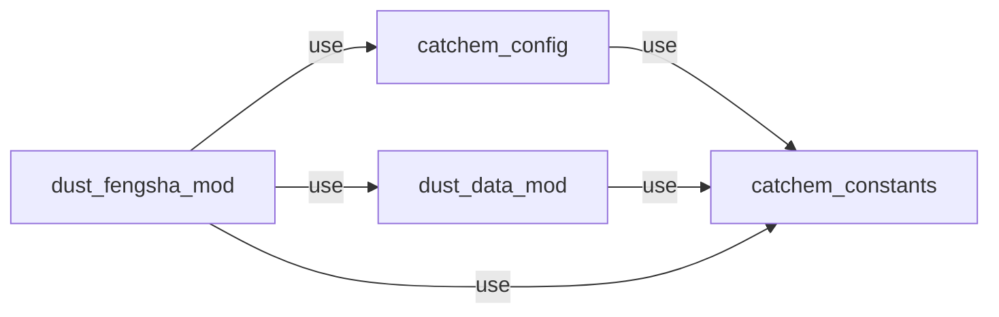

## FENGSHA CCPP for CATChem example

### FENGSHA library (CCPP independent; [`src`](./src))

* `catchem_constants`
  - defines the real kind (double precision) `kind_chem`
  - physical constants
* `catchem_config`
  - some parameters for chemistry and physics schemes
    - not all specific/relevant to FENGSHA at this time
  - indicies for species
* `dust_data_mod`
  - FENGSHA-specific parameters, including radius bin definitions (currently hardcoded)
* `dust_fengsha_mod`
  - FENGSHA routine that takes **point inputs**

### CCPP driver ([`driver/ccpp`](./driver/ccpp))

Uses all of the FENGSHA library modules,
which are compiled into a single static library in the CMake build.

Routines `catchem_chem_dust_wrapper_{init,finalize,run}`:

* `init` and `finalize` currently do nothing
* `run`
  - takes **array inputs**, array extent indices, scheme options/flags
  - loop over `i` and `j` indices calls the FENGSHA routine from `dust_fengsha_mod`
    and stores the results
  - currently some inputs to the routine are not used by FENGSHA,
    but we are leaving them for now in case other dust schemes need them

